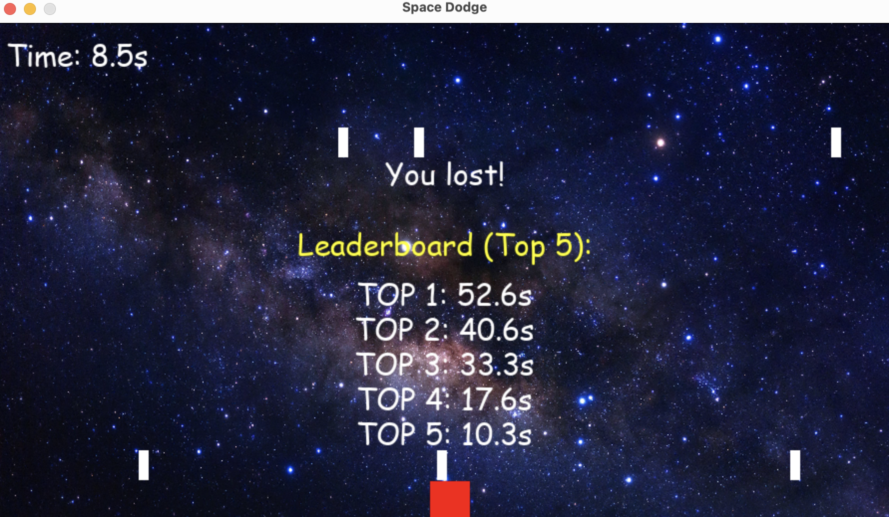

# Space Dodge Game

A simple 2D space dodging game built with Python and Pygame.

## Description
In **Space Dodge**, you control a spaceship and try to avoid falling stars. The longer you survive, the higher your score!
The game features a High Score system that tracks the top 5 survival times.

## Features
- **Smooth Movement**: Control your spaceship with arrow keys.
- **Increasing Difficulty**: Stars fall faster and more frequently as time passes.
- **High Score System**: Automatically saves and displays the top 5 best times.
- **Cool Graphics**: Space background and simple geometric designs.

## Requirements
- Python 3.x
- Pygame

## Installation
1. Clone the repository:
   ```bash
   git clone https://github.com/gotbutchi/Space-Dodge-Game.git
   ```
2. Install the required dependency:
   ```bash
   pip install pygame
   ```

## How to Play
1. Run the game:
   ```bash
   python main.py
   ```
2. Use the **Arrow Keys** to move the spaceship:
   - `LEFT`: Move left
   - `RIGHT`: Move right
   - `UP`: Move up
   - `DOWN`: Move down
3. Dodge the falling stars for as long as possible.
4. If you get hit, the game is over and your time will be recorded on the leaderboard.

## Screenshots

